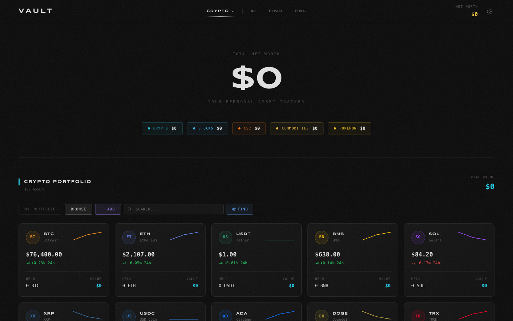

# Halide Vault

A dashboard to track everything you own in one place: crypto, stocks, CS2 skins, precious metals and Pokémon cards, with live prices.

**[Open the app →](https://halides.netlify.app)**



## Features

- **Multi-asset portfolio**: crypto, stocks, CS2 skins, commodities (gold, silver, platinum, palladium) and Pokémon
- **Live prices**: CoinGecko for crypto, Nasdaq and Yahoo Finance for stocks and metals, Steam Community Market for CS2 skins
- **Search**: any crypto or stock, added to the portfolio or tracked without holding it
- **PnL**: unrealized gains and losses per asset, daily change, total invested vs. current value
- **30-day charts**
- **User accounts**: each portfolio is stored in Firestore and readable only by its owner

## Architecture

| Folder | Role |
|---|---|
| `app/api/` | Server routes that query the price APIs (`prices`, `cs2prices`, `chart`, `stockchart`, `lookup`) |
| `components/ui/` | One component per tab (`vault-crypto`, `vault-cs2`, `vault-pnl`…) plus the modals |
| `lib/` | Firebase client, auth context, price context |
| `firestore.rules` | Access restricted to the signed-in user's `portfolios/{uid}` document |

The Netlify deployment adds security headers (CSP, `X-Frame-Options`, `Referrer-Policy`), see `netlify.toml`.

## Stack

Next.js 16 · React 19 · TypeScript · Tailwind CSS · Firebase (Auth, Firestore) · Framer Motion · lightweight-charts · Netlify

## Run locally

Create a `.env.local` file with your Firebase project config:

```bash
NEXT_PUBLIC_FIREBASE_API_KEY=
NEXT_PUBLIC_FIREBASE_AUTH_DOMAIN=
NEXT_PUBLIC_FIREBASE_PROJECT_ID=
NEXT_PUBLIC_FIREBASE_STORAGE_BUCKET=
NEXT_PUBLIC_FIREBASE_MESSAGING_SENDER_ID=
NEXT_PUBLIC_FIREBASE_APP_ID=
```

Then:

```bash
npm ci
npm run dev
# http://localhost:3000
```

## License

[MIT](LICENSE)
